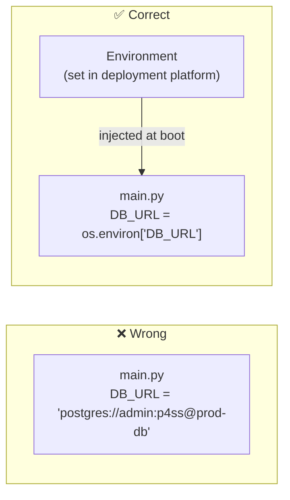
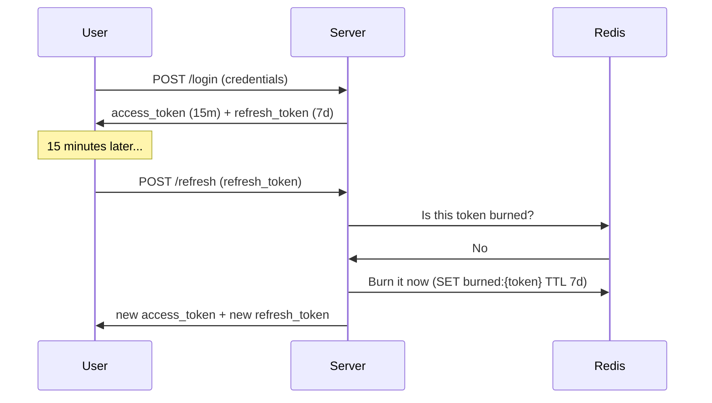
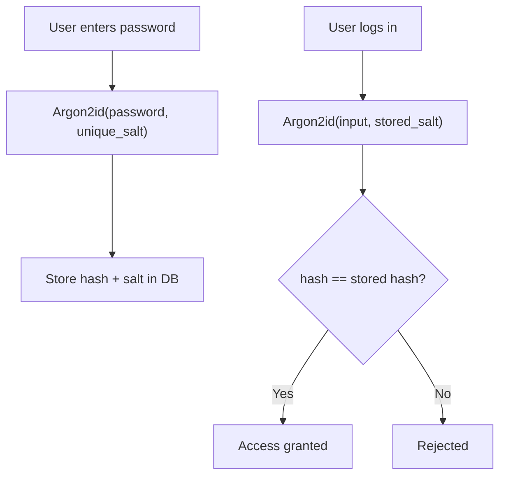
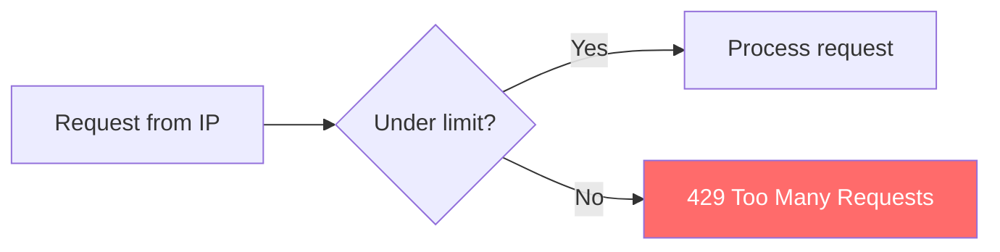
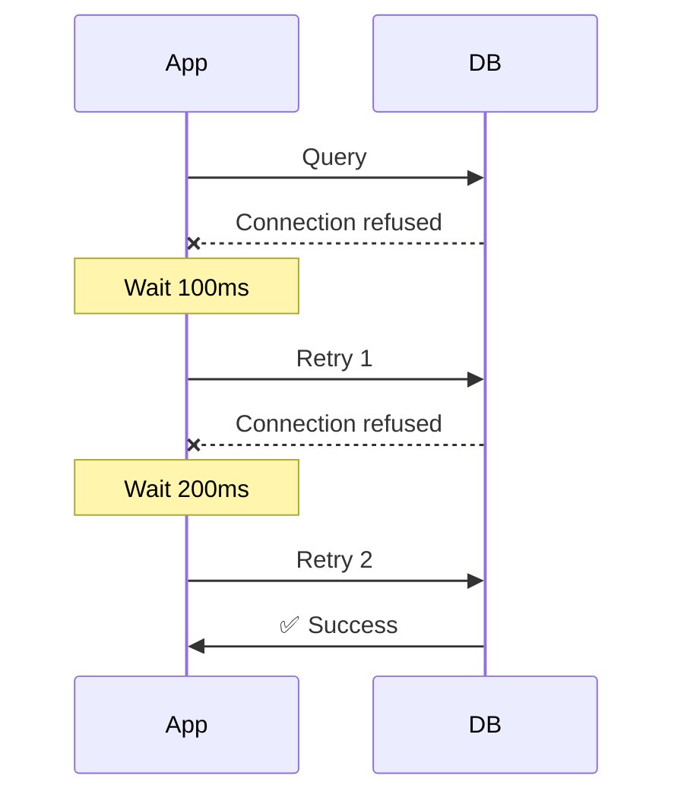
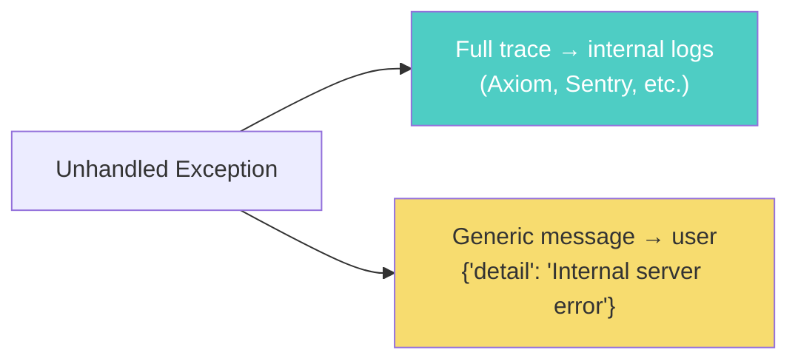
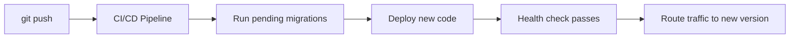

# Backend API Deployment Checklist

You built the API. It runs on localhost. Now you're about to expose it to the internet — and every shortcut you took in development becomes a live vulnerability. This checklist walks through the ten things to verify before you deploy, with enough depth to actually understand *why* each one matters.

---

## 1. Secrets Management — No Hardcoded Credentials

**What it means.** Database passwords, API keys, JWT secrets, and third-party tokens live in **environment variables** injected at runtime — never in source code, never in config files committed to git.

**Why it matters.** If credentials are in your code, they're in your git history forever. Anyone with read access to the repo (or a leaked `.git` folder) owns your database. Environment variables are injected by the deployment platform (Render, Railway, AWS, etc.) and never touch disk or version control.



**Quick check:** Run `git log -p | grep -i password` on your repo. If anything comes back — you have a problem.

---

## 2. Authentication — Short-Lived JWTs with Revocable Refresh Tokens

**What it means.** Issue two tokens at login:

| Token | Lifetime | Purpose |
|---|---|---|
| Access token | 15 minutes | Authenticates every request |
| Refresh token | 7 days | Gets a new access token when the old one expires |

The refresh token is **single-use** — once redeemed, it's burned. If a burned token is presented again, all sessions for that user are revoked immediately (token rotation).

**Why it matters.** A long-lived token is a permanent skeleton key. If stolen, the attacker has access for as long as the token lives. Short access tokens limit the blast radius to minutes. Token rotation means even a stolen refresh token triggers an alarm the moment the real user refreshes.



---

## 3. CORS — Strictly Whitelisted Origins

**What it means.** **CORS** (Cross-Origin Resource Sharing) controls which domains browsers are allowed to call your API from. In production, this must be an explicit allowlist — typically just your frontend domain.

**Why it matters.** A wildcard (`*`) or leftover `localhost` entry lets any website make authenticated requests to your API using a visitor's browser cookies/tokens. The attacker doesn't need to break into your server — they just need the victim to visit a malicious page.

```python
# ❌ Never in production
origins = ["*"]

# ✅ Explicit allowlist
origins = ["https://yourapp.com", "https://www.yourapp.com"]
```

> CORS is a **browser** safeguard. Server-to-server calls bypass it entirely — that's what authentication and authorization handle.

---

## 4. Password Storage — Argon2id with Unique Salts

**What it means.** Passwords are hashed using **Argon2id** (winner of the Password Hashing Competition) with a unique random salt per user. You never store the password itself — only the hash. When a user logs in, you hash their input with the same salt and compare.

**Why it matters.** If your database leaks:
- **Plain text** → every account is instantly compromised
- **MD5/SHA** → cracked in seconds with rainbow tables
- **bcrypt** → good, but Argon2id is better against modern GPUs
- **Argon2id + unique salt** → each password must be attacked individually, and the algorithm is deliberately slow and memory-hard, making GPU brute-force economically impractical



---

## 5. Input Validation — Reject Before It Hits Business Logic

**What it means.** Every piece of data from the client — request body, query params, headers — passes through a strict schema (Zod, Pydantic, Joi, etc.) before your code touches it. Malformed or unexpected data is rejected at the gate with a `422`.

**Why it matters.** Unvalidated input is the root cause of:
- **SQL injection** — `'; DROP TABLE users; --`
- **XSS** — `<script>steal(document.cookie)</script>`
- **Type confusion** — sending a string where an integer is expected, crashing your logic
- **Overposting** — sneaking extra fields like `"role": "admin"` into a request body

Schema validation guarantees your business logic only ever sees clean, typed, expected data.

```python
# Pydantic example — anything outside this shape is rejected automatically
class CreateUser(BaseModel):
    email: EmailStr
    password: str = Field(min_length=8, max_length=128)
    name: str = Field(max_length=100)
```

---

## 6. Rate Limiting — Cap Requests Per IP

**What it means.** Limit how many requests a single IP (or user/API key) can make within a time window. Common defaults:

| Endpoint type | Limit |
|---|---|
| Login / password reset | 5/minute |
| General API | 100/minute |
| Expensive operations (search, export) | 10/minute |

**Why it matters.** Without rate limits you're exposed to:
- **Brute-force** attacks on login
- **Credential stuffing** at scale
- **DDoS** from a single aggressive client
- **Surprise cloud bills** when someone loops your most expensive endpoint

A rate limiter is cheap to add and expensive to forget.



---

## 7. Database Connection Resilience — Retry with Exponential Backoff

**What it means.** When a database connection fails (network blip, failover, cold start), your app doesn't crash immediately. Instead, it retries with increasing delays: 100ms → 200ms → 400ms → 800ms → give up and return 503.

**Why it matters.** Production databases go through brief unavailability during:
- Failovers (managed database promoting a replica)
- Network partitions (cloud networking hiccups)
- Connection pool exhaustion (burst of traffic)

A single retry with backoff survives most of these transparently. Without it, a 200ms blip cascades into thousands of failed requests.



---

## 8. Global Error Handling — Catch Everything, Log Everything

**What it means.** A global error middleware wraps your entire application. Any unhandled exception is:
1. Caught before it crashes the process
2. Logged with full context (stack trace, request ID, user ID, timestamp) to a logging service (Axiom, Datadog, Sentry, etc.)
3. Replaced with a clean generic response to the user

**Why it matters.** Without global error handling:
- One uncaught exception kills the process and drops all in-flight requests
- You have no record of what went wrong
- Debugging production issues becomes guesswork

```python
@app.exception_handler(Exception)
async def global_handler(request: Request, exc: Exception):
    logger.error(f"Unhandled error", exc_info=exc, extra={
        "path": request.url.path,
        "method": request.method,
    })
    return JSONResponse(status_code=500, content={"detail": "Internal server error"})
```

---

## 9. No Stack Traces in Responses — Clean Error Messages

**What it means.** Users and attackers see a generic message like `"Internal server error"`. The full stack trace, file paths, library versions, and query fragments stay in your internal logs — never in the HTTP response.

**Why it matters.** A stack trace tells an attacker:
- What framework and version you're running (targeted CVE exploits)
- Your file structure and function names (maps your codebase)
- Database query fragments (reveals schema and potential injection points)
- Environment variable names (hints at what secrets exist)



---

## 10. Automated Database Migrations in CI/CD

**What it means.** Schema changes (new tables, columns, indexes, constraints) run automatically in your deployment pipeline — right before the new application code boots. Tools like Alembic (Python), Prisma Migrate (Node), or Flyway (Java) track which migrations have been applied and run only the new ones.

**Why it matters.**
- **Manual migrations are forgotten.** Under pressure, someone forgets to run `ALTER TABLE` and the new code crashes on a missing column.
- **Order matters.** The migration must complete before the new code starts — otherwise the app references columns that don't exist yet.
- **Rollbacks need a plan.** Every migration should have a corresponding down migration so you can revert if the deploy goes wrong.



---

## TL;DR

Before you hit deploy:

| # | Check | One-liner |
|---|---|---|
| 1 | **Secrets** | Environment variables, never in code |
| 2 | **Auth** | Short-lived access tokens + rotated refresh tokens |
| 3 | **CORS** | Explicit domain allowlist, never `*` |
| 4 | **Passwords** | Argon2id + unique salt per user |
| 5 | **Input validation** | Schema rejects bad data before business logic |
| 6 | **Rate limiting** | Cap requests per IP, especially on sensitive routes |
| 7 | **DB resilience** | Retry with exponential backoff on connection failure |
| 8 | **Error handling** | Global middleware catches + logs everything |
| 9 | **No leaks** | Stack traces stay in logs, users get clean messages |
| 10 | **Migrations** | Automated in CI/CD, run before new code boots |

If any of these is a "we'll add it later" — that's the one that breaks on day one.
