# Hướng dẫn vẽ hình minh hoạ — Chương 4 (Thiết kế hệ thống)

Tài liệu này mô tả nội dung và cách vẽ 16 hình minh hoạ tương ứng với các vị trí "📷 CHÈN ẢNH" trong file `Chuong4_Thiet_ke_he_thong.docx`. Mỗi hình gồm: **mục đích**, **các khối/nút cần có**, **luồng/quan hệ**, **công cụ gợi ý** và (khi phù hợp) **mã nguồn sẵn để render** bằng Mermaid hoặc Python.

---

## Quy ước chung

**Công cụ đề xuất**
- **Sơ đồ khối / luồng / kiến trúc:** [draw.io (diagrams.net)](https://app.diagrams.net), [Excalidraw](https://excalidraw.com), hoặc **Mermaid** ([mermaid.live](https://mermaid.live)) — dán mã trong tài liệu này, xuất PNG/SVG.
- **Sơ đồ tuần tự (sequence):** Mermaid (`sequenceDiagram`) hoặc [PlantUML](https://www.plantuml.com/plantuml).
- **Biểu đồ số liệu (Hình 4.6, 4.7):** Python + matplotlib (mã sẵn bên dưới).
- **Ảnh chụp màn hình (Hình 4.9, 4.10):** chụp trực tiếp ứng dụng web.

**Thống nhất hình thức** (để cả chương đồng bộ)
- Bảng màu: nền khối xanh nhạt `#D9E2F3`, viền `#2E5496`, chữ đen; nhấn mạnh dùng `#1F3864`. Nhánh phụ/điều kiện dùng xám `#888888`.
- Font trong hình: Arial/Calibri, cỡ ≥ 11pt để khi thu nhỏ vào A4 vẫn đọc được.
- Xuất ảnh **PNG ≥ 150 DPI** hoặc **SVG**; bề rộng khít cột (~15–16 cm).
- Mũi tên nét liền = luồng chính; nét đứt = nhánh phụ/fallback/triển khai Protocol.
- Caption đặt **dưới** hình, in nghiêng, đúng số hiệu (ví dụ: *Hình 4.1. Sơ đồ kiến trúc thành phần tổng thể*).

**Bản đồ nhanh hình → công cụ**

| Hình | Loại | Công cụ gợi ý |
|---|---|---|
| 4.1, 4.2, 4.3 | Kiến trúc / quan hệ | Mermaid `flowchart` hoặc draw.io |
| 4.4, 4.5 | Luồng xử lý | Mermaid `flowchart` |
| 4.6, 4.7 | Biểu đồ số liệu | Python + matplotlib |
| 4.8, 4.11 | Tuần tự | Mermaid `sequenceDiagram` |
| 4.9, 4.10 | Ảnh chụp UI | Chụp màn hình |
| 4.12, 4.13, 4.14, 4.15, 4.16 | Luồng / triển khai | Mermaid `flowchart` |

---

## Hình 4.1 — Sơ đồ kiến trúc thành phần tổng thể
*Vị trí: mục 4.1*

**Mục đích:** cho người đọc thấy bức tranh toàn cảnh các dịch vụ và cách chúng nối với nhau.

**Khối cần có:** React Web App; Nginx reverse proxy; api-service (FastAPI, 5 tầng); ml-service (Extra Trees); Celery worker; Valkey (broker + rate-limit); PostgreSQL 17 + PostGIS + Timescale; ChirpStack server.

**Luồng:** Web → (HTTPS/SSE) → Nginx → api-service; api-service ↔ ml-service (HTTP `/residual`); api-service → DB; api-service ↔ Valkey; Celery ↔ Valkey; Celery → ml-service (retrain → reload artifact); ChirpStack → api-service (webhook).

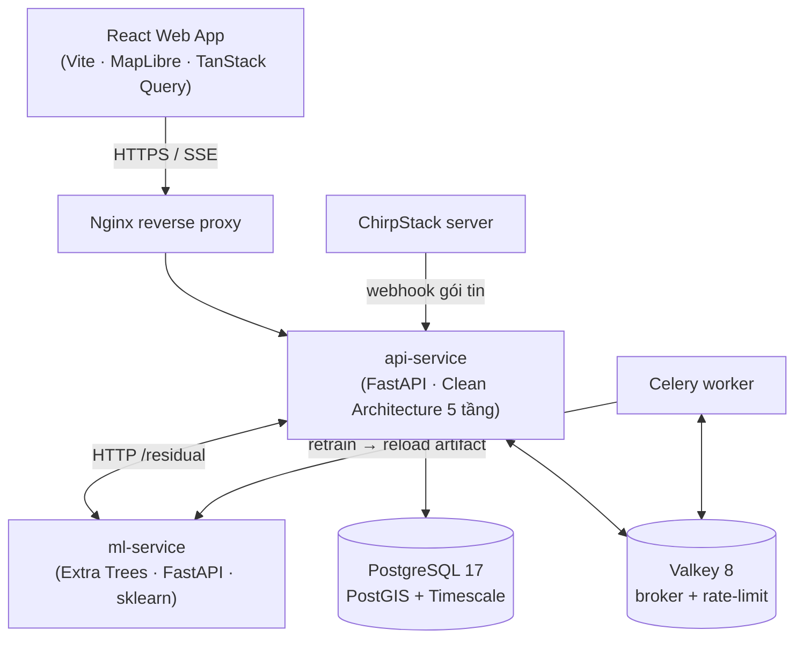

---

## Hình 4.2 — Sơ đồ quan hệ năm tầng (Clean Architecture)
*Vị trí: mục 4.2*

**Mục đích:** minh hoạ chiều phụ thuộc và nguyên tắc đảo ngược phụ thuộc (DIP).

**Khối:** `edge/`, `application/`, `domain/`, `infrastructure/`.

**Quan hệ:** `edge → application → domain`; `infrastructure → domain`; `infrastructure` **hiện thực hoá** Protocol do `application` định nghĩa (vẽ bằng mũi tên **nét đứt** hướng từ infrastructure lên application để thể hiện DIP). Nên ghi chú: "domain không phụ thuộc tầng nào".

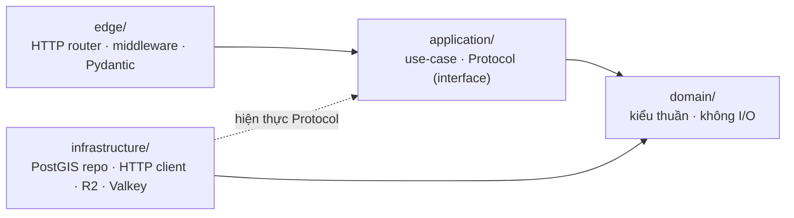

> Gợi ý: tô `domain/` màu đậm hơn để nhấn nó là lõi; vẽ một mũi tên ngoài cùng chú thích "import-linter enforce ranh giới".

---

## Hình 4.3 — Sơ đồ bố cục schema cơ sở dữ liệu
*Vị trí: mục 4.3.3*

**Mục đích:** thể hiện 5 schema và các bảng tiêu biểu, kèm liên kết khoá ngoại quan trọng.

**Khối (group theo schema):**
- `geo`: gateways, gateway_quarantine, devices, addresses
- `ts`: survey_training (hypertable), survey_quarantine, chirpstack_events
- `auth`: users, refresh_tokens, login_attempts, password_reset_tokens
- `ml`: active_models, retrain_jobs, upload_batches
- `ops`: coverage_rebuild_jobs, daily_visits

**Quan hệ cần làm nổi:** `ts.survey_training.gateway_id → geo.gateways`; `auth.refresh_tokens.user_id → auth.users`. Đánh dấu `survey_training` là **hypertable Timescale**.

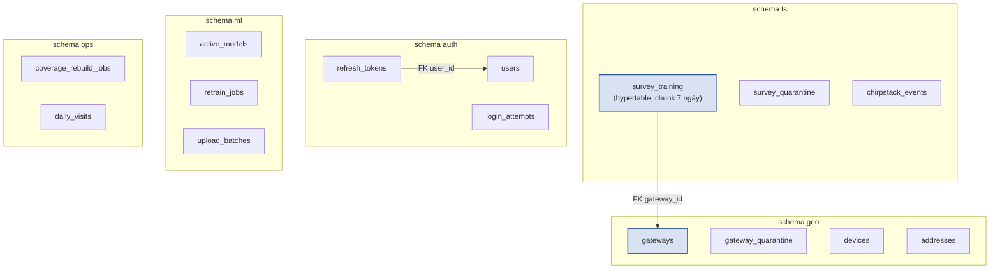

> Nếu muốn chuẩn hơn, vẽ lại bằng **draw.io** dạng ERD với các trường chính của `gateways` (location GiST), `survey_training` (timestamp).

---

## Hình 4.4 — Sơ đồ khối pipeline Tầng 1 (ITU-R P.1812)
*Vị trí: mục 4.4.1*

**Mục đích:** trình tự tính toán vật lý từ đầu vào tới đầu ra.

**Chuỗi khối (tuyến tính):** Input → P.1812 (path loss terrain) → P.2108 (clutter, bỏ qua nếu có DSM) → P.2109 (building entry loss, nếu indoor) → hiệu chỉnh noise floor theo từng gateway → link budget UL/DL → Output.

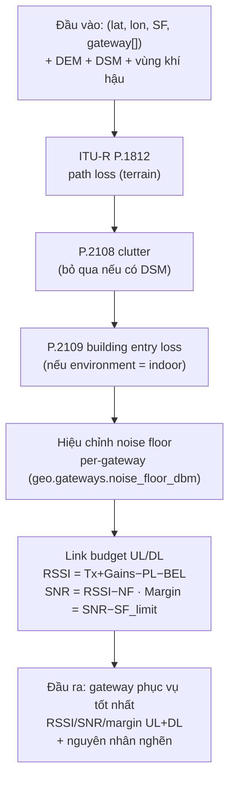

---

## Hình 4.5 — Sơ đồ luồng phối hợp Tầng 1 ↔ Tầng 2
*Vị trí: mục 4.4.2*

**Mục đích:** thể hiện cách api-service và ml-service phối hợp, gồm nhánh ML tắt và nhánh fallback khi lỗi.

**Điểm cần có:** nút quyết định "ML bật?"; lời gọi `POST /residual`; phép cộng `rssi_final = rssi_stage1 + residual_db`; bước tính lại SNR/margin/SF/PDR/BER; mũi tên **nét đứt** từ lời gọi ml-service về nhánh "Trả về Stage 1" để biểu thị fallback.

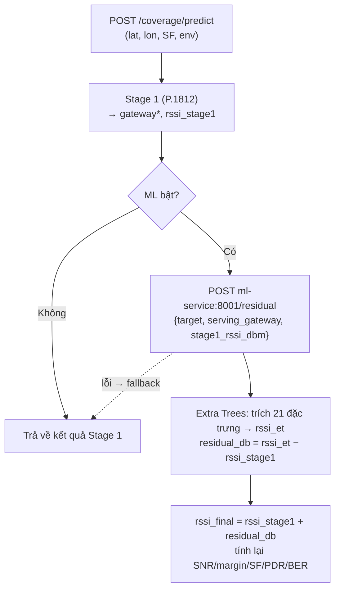

---

## Hình 4.6 — Biểu đồ so sánh sai số mô hình
*Vị trí: mục 4.4.3 (số liệu Bảng 4.4 và Bảng 4.5)*

**Mục đích:** trực quan hoá việc Extra Trees vượt baseline XGBoost; tuỳ chọn thêm RMSE theo bin khoảng cách.

**Công cụ:** Python + matplotlib. Lưu `hinh_4_6.png` ở 150 DPI.

```python
import matplotlib.pyplot as plt
import numpy as np

# --- (a) So sánh ET vs XGBoost (Bảng 4.4) ---
metrics = ["RMSE", "MAE", "Bias"]
et   = [7.10, 4.98, 2.61]
xgb  = [10.58, 7.80, 0.77]
x = np.arange(len(metrics)); w = 0.36

fig, (ax1, ax2) = plt.subplots(1, 2, figsize=(10, 4))
ax1.bar(x - w/2, et,  w, label="Extra Trees", color="#2E5496")
ax1.bar(x + w/2, xgb, w, label="XGBoost v0.6", color="#A6A6A6")
ax1.set_xticks(x); ax1.set_xticklabels(metrics)
ax1.set_ylabel("dB"); ax1.set_title("(a) ET vs XGBoost (temporal hold-out)")
ax1.legend(); ax1.grid(axis="y", ls=":", alpha=.5)

# --- (b) RMSE theo bin khoảng cách (Bảng 4.5) ---
bins = ["0–2 km", "2–5 km", "5–10 km"]
rmse = [8.21, 2.32, 2.44]
ax2.bar(bins, rmse, color="#2E5496")
ax2.set_ylabel("RMSE (dB)"); ax2.set_title("(b) RMSE theo khoảng cách")
ax2.grid(axis="y", ls=":", alpha=.5)
for i, v in enumerate(rmse): ax2.text(i, v + 0.1, f"{v:.2f}", ha="center")

plt.tight_layout()
plt.savefig("hinh_4_6.png", dpi=150)
```

> Nếu chỉ cần một biểu đồ, giữ phần (a). Lưu ý chú thích rõ đây là tập **temporal hold-out** (n = 337).

---

## Hình 4.7 — Biểu đồ tương quan dự đoán và đo thực tế
*Vị trí: mục 4.4.3*

**Mục đích:** minh hoạ R² = 0,8671 và bias +2,61 dB (xu hướng over-predict ở vùng gần).

**Yêu cầu dữ liệu:** cần mảng RSSI đo thực tế (`y_true`) và RSSI dự đoán (`y_pred`) trên tập kiểm chứng. Xuất từ script đánh giá mô hình của bạn (ví dụ lưu ra CSV `eval_predictions.csv`).

```python
import matplotlib.pyplot as plt
import numpy as np, pandas as pd

df = pd.read_csv("eval_predictions.csv")   # cột: y_true, y_pred
y_true, y_pred = df["y_true"].values, df["y_pred"].values

lim = [min(y_true.min(), y_pred.min()) - 2, max(y_true.max(), y_pred.max()) + 2]
plt.figure(figsize=(5.5, 5.5))
plt.scatter(y_true, y_pred, s=14, alpha=.5, color="#2E5496", edgecolors="none")
plt.plot(lim, lim, "k--", lw=1, label="y = x (lý tưởng)")
plt.xlim(lim); plt.ylim(lim)
plt.xlabel("RSSI đo thực tế (dBm)"); plt.ylabel("RSSI dự đoán (dBm)")
plt.title("Tương quan dự đoán vs đo thực tế (R² = 0.867)")
plt.legend(); plt.grid(ls=":", alpha=.5)
plt.tight_layout(); plt.savefig("hinh_4_7.png", dpi=150)
```

> Nếu không có sẵn mảng dự đoán điểm, có thể thay bằng biểu đồ phân phối phần dư (histogram của `y_pred − y_true`) để minh hoạ bias dương.

---

## Hình 4.8 — Sơ đồ tuần tự lời gọi `/coverage/predict`
*Vị trí: mục 4.5*

**Mục đích:** mô tả trình tự thời gian giữa Web App, api-service và ml-service.

**Tác nhân:** Web App, api-service, ml-service. **Các bước:** gửi request kèm JWT → xác thực + rate-limit → Stage 1 → gọi `/residual` → nhận `residual_db` → tổng hợp + tính lại chỉ số → trả về. Ghi chú nhánh fallback.

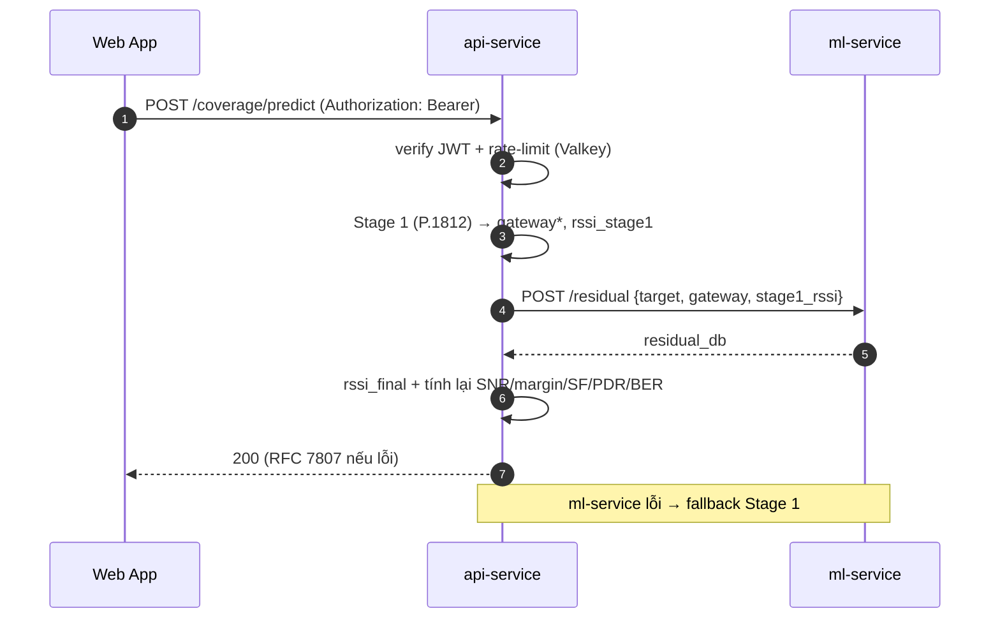

---

## Hình 4.9 — Ảnh chụp giao diện ba chế độ bản đồ
*Vị trí: mục 4.6 (ảnh chụp thật)*

**Mục đích:** minh hoạ 3 chế độ hiển thị của MapLibre.

**Cách thực hiện:**
1. Mở ứng dụng web, vào trang bản đồ vùng Đà Nẵng (để thấy đủ gateway).
2. Chụp lần lượt 3 trạng thái layer: **điểm khảo sát (points)**, **bản đồ nhiệt RSSI (heatmap)**, **bản đồ SF tối thiểu (estimate)**.
3. Ghép 3 ảnh thành 1 hình (xếp ngang hoặc lưới 1×3), gắn nhãn (a)(b)(c) ở góc.

**Lưu ý:** ẩn dữ liệu nhạy cảm (email người dùng); chụp ở độ phân giải cao; giữ cùng mức zoom/khu vực cho cả 3 ảnh để dễ so sánh.

---

## Hình 4.10 — Ảnh chụp panel dự đoán điểm
*Vị trí: mục 4.6 (ảnh chụp thật)*

**Mục đích:** minh hoạ kết quả dự đoán một điểm với link budget hai chiều.

**Cách thực hiện:** click một toạ độ trên bản đồ để mở popup/panel; chụp panel hiển thị RSSI/SNR/PDR, SF khuyến nghị, bộ chọn SF và phần link budget UL/DL. Có thể khoanh đỏ + chú thích các trường quan trọng để giảng giải trong báo cáo.

---

## Hình 4.11 — Sơ đồ tuần tự đăng nhập và làm mới token
*Vị trí: mục 4.7*

**Mục đích:** mô tả luồng cấp token, kiểm tra vai trò và (tuỳ chọn) xoay vòng refresh token.

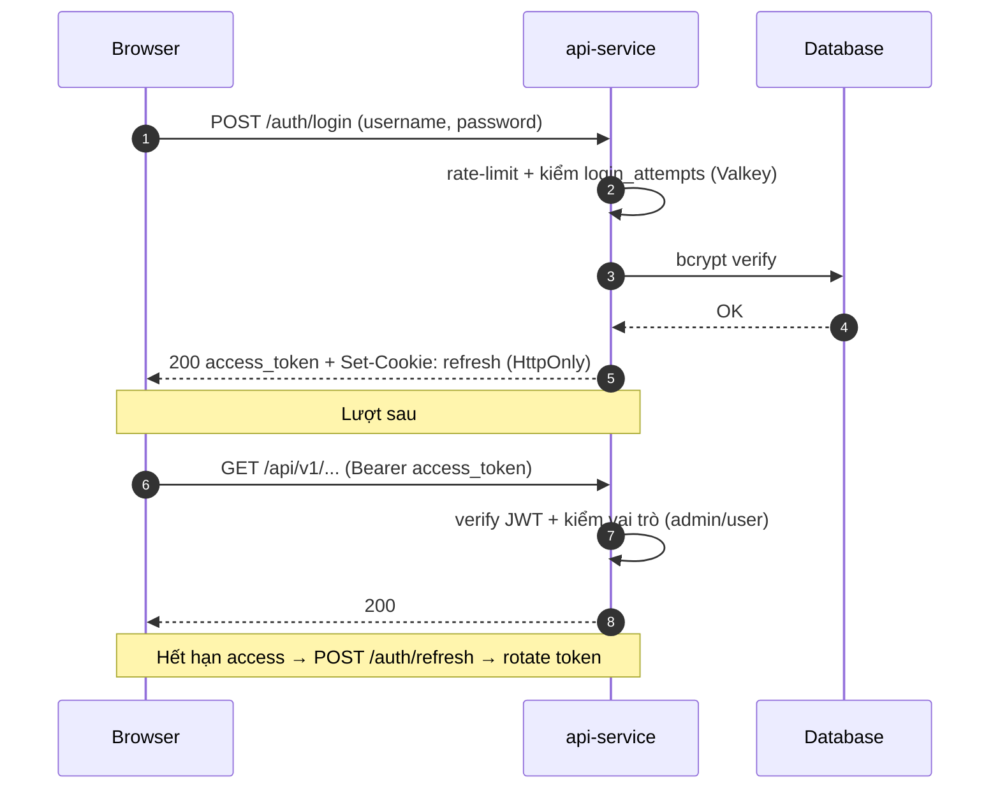

> Có thể bổ sung khối "5 lần sai/15 phút → khoá 30 phút" ở nhánh đăng nhập thất bại.

---

## Hình 4.12 — Sơ đồ luồng tác vụ nền Celery
*Vị trí: mục 4.8*

**Mục đích:** thể hiện cách công việc nặng được đẩy qua hàng đợi và worker xử lý.

**Khối:** api-service → Valkey broker → Celery worker; các nhánh tác vụ: `retrain_ml_model` (→ swap artifact → reload ml-service), `rebuild_coverage_heatmap`, `sync_linked_source` (lịch 20s).

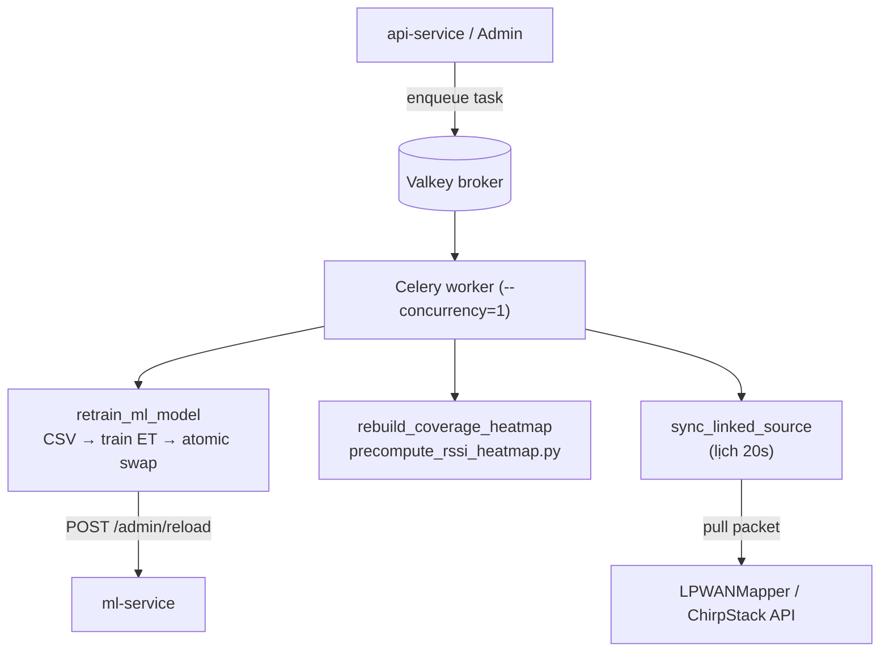

---

## Hình 4.13 — Sơ đồ luồng dữ liệu thời gian thực
*Vị trí: mục 4.9*

**Mục đích:** mô tả đường đi gói tin từ gateway tới client qua webhook và SSE.

**Khối + nhánh:** Gateway → ChirpStack → `POST /chirpstack/webhook` → ghi `ts.chirpstack_events`; rồi tách 2 nhánh song song: (1) Celery dedup → promote `ts.survey_training`; (2) SSE fan-out → các client panel.

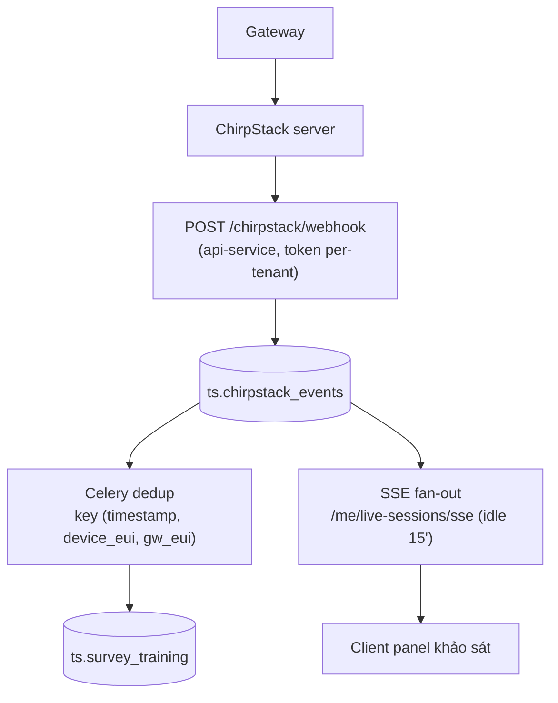

---

## Hình 4.14 — Sơ đồ ngăn xếp triển khai Docker Compose
*Vị trí: mục 4.10.1*

**Mục đích:** thể hiện các container, liên kết mạng và lưu trữ.

**Khối (container):** lora-wan-db, lora-wan-migrate (chạy 1 lần), lora-wan-api, lora-wan-ml, lora-wan-celery, lora-wan-cache; thêm Nginx ở ngoài. **Lưu ý:** DB bind `127.0.0.1:5432`; volume `lora-wan-db-data`; bind mount DEM/OSM/report; mạng bridge `lora-wan-net`.

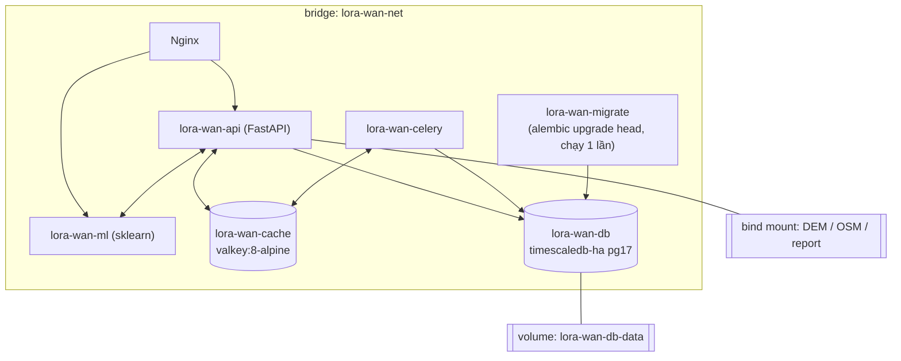

> Ghi chú trên hình: "DB chỉ bind loopback 127.0.0.1:5432".

---

## Hình 4.15 — Sơ đồ luồng CI ba job song song
*Vị trí: mục 4.11*

**Mục đích:** thể hiện 3 job chạy song song và điểm hợp nhất.

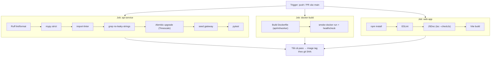

> Nếu Mermaid báo lỗi cú pháp `--> MERGE` sau nhóm, tách thành: `J1 --> MERGE`, `J2 --> MERGE`, `J3 --> MERGE`.

---

## Hình 4.16 — Sơ đồ luồng kiểm duyệt gateway và dữ liệu khảo sát
*Vị trí: mục 4.14*

**Mục đích:** mô tả quy trình từ dữ liệu thô tới dữ liệu huấn luyện qua bước duyệt của admin.

**Khối + nhánh:** nguồn liên kết → sync → quarantine (survey + gateway lạ) → admin duyệt → (gateway → `geo.gateways` + backfill FK) và (batch → `ts.survey_training`) → trigger reset cờ rebuild + tuỳ chọn retrain ML.

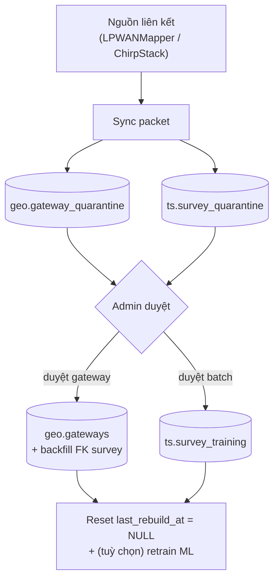

> Có thể thêm nhánh "Upload CSV/JSON → gặp gateway lạ → **reject row**" để phản ánh mục 4.14.

---

## Ghi chú cuối

- code đặt trong lora-coverage\docs\code, ảnh đặt trong lora-coverage\docs\anh
- Không cần đặt ghi tên hình trong ảnh, đặt tên ảnh theo từng mục để dễ phân biệt
